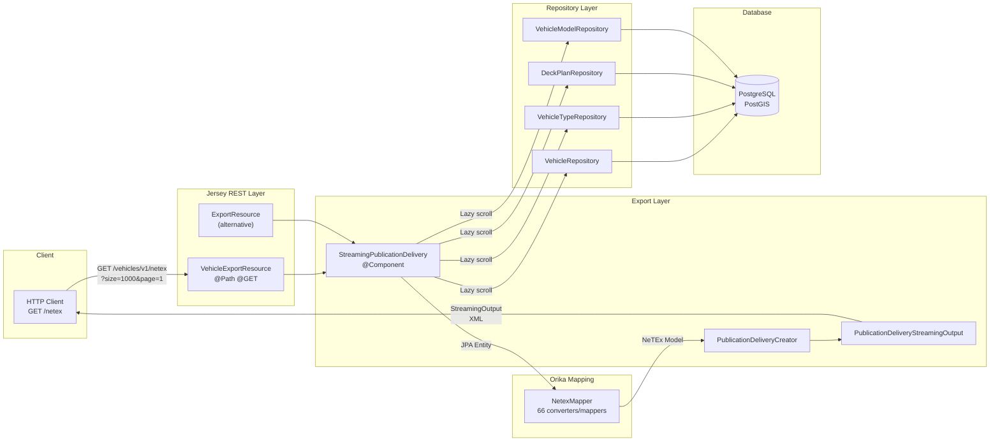
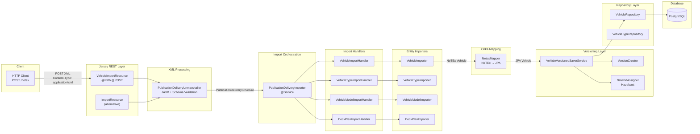
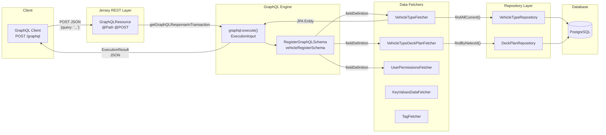
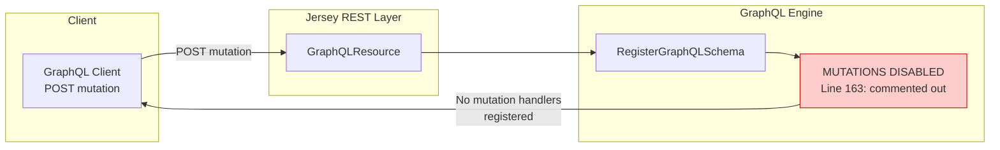
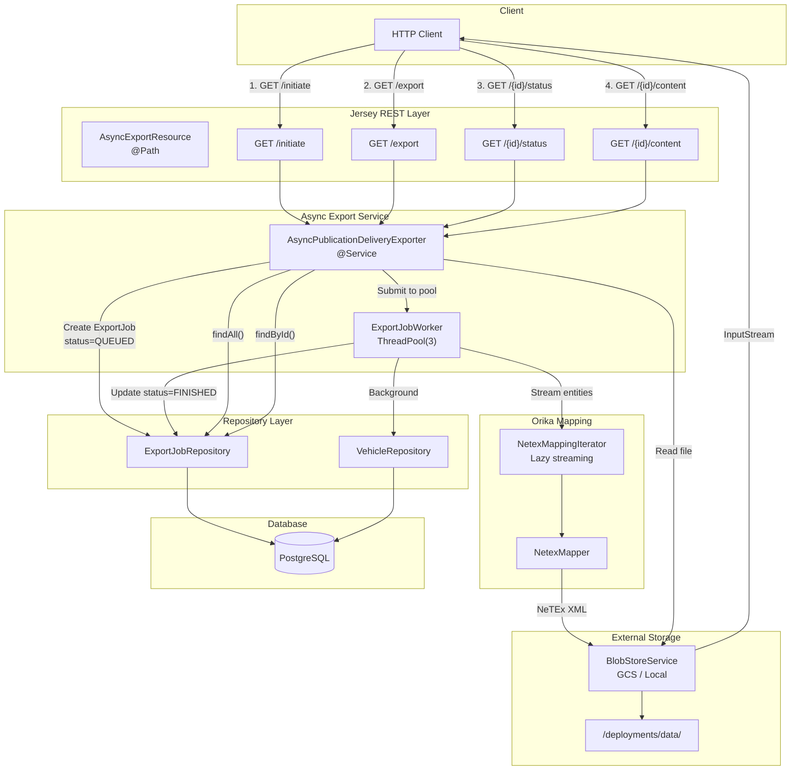
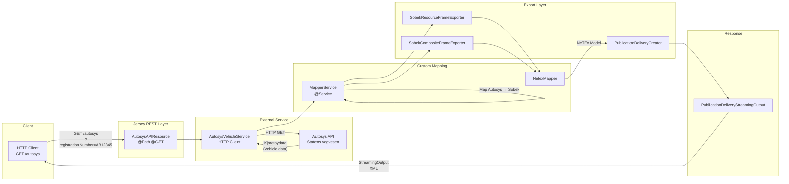

# Sobek API Flow Architecture

> Reverse-engineered architectural overview of Sobek's API layer.
> Generated: January 2025

## Overview

Sobek exposes two primary API interfaces:
- **Jersey (JAX-RS)** - REST endpoints for NeTEx XML import/export
- **GraphQL** - Query API for vehicle data (mutations currently disabled)

This document describes 5 distinct API flows, their dependencies, and data transformation layers.

---

## Heavy Dependencies Summary

| Dependency | Purpose | Used In |
|------------|---------|---------|
| **Orika** (`ma.glasnost.orika`) | Bidirectional mapping: JPA entities ↔ NeTEx model | Import, Export, Autosys |
| **netex-java-model** (`org.rutebanken.netex.model`) | JAXB-generated NeTEx XML bindings | All flows except GraphQL |
| **JAXB** (`jakarta.xml.bind`) | XML marshalling/unmarshalling | Import, Export, Autosys |
| **graphql-java** | GraphQL schema & execution | GraphQL Read |
| **Hibernate Spatial** | PostGIS integration | All flows (persistence) |
| **Hazelcast** | Distributed ID generation, caching | Import (versioning) |
| **BlobStoreService** | GCS/local file storage | Async Export |
| **autosys** (`org.entur.autosys`) | Norwegian vehicle registry client | Autosys Integration |

---

## Flow 1: Jersey Query (REST GET - Sync Export)

Synchronous NeTEx XML export via streaming response.

### Mermaid Diagram



### Key Classes

| Class | Location | Responsibility |
|-------|----------|----------------|
| `VehicleExportResource` | `rest/netex/publicationdelivery/VehicleExportResource.java` | Entry point, `@GET` |
| `StreamingPublicationDelivery` | `exporter/StreamingPublicationDelivery.java` | Lazy entity iteration |
| `NetexMapper` | `netex/mapping/NetexMapper.java` | Orika facade |
| `PublicationDeliveryStreamingOutput` | `rest/netex/.../PublicationDeliveryStreamingOutput.java` | JAXB marshalling |

### Dependencies Introduced

| Dependency | Why |
|------------|-----|
| **Orika** | Maps `Vehicle` (JPA) → `Vehicle` (NeTEx) |
| **netex-java-model** | Target type for mapping, JAXB serialization |
| **JAXB** | `Marshaller.marshal()` for XML output |
| **Hibernate ScrollableResults** | Memory-efficient large dataset export |

### Orika Mappers Used

```
VehicleMapper, VehicleTypeMapper, VehicleModelMapper, DeckPlanMapper,
DeckMapper, PassengerSpaceMapper, PassengerSpotMapper, + 20 converters
```

---

## Flow 2: Jersey Command (REST POST - Import)

NeTEx XML import with entity versioning and ID generation.

### Mermaid Diagram



### Key Classes

| Class | Location | Responsibility |
|-------|----------|----------------|
| `VehicleImportResource` | `rest/netex/.../VehicleImportResource.java:78-105` | Entry point, `@POST` |
| `PublicationDeliveryUnmarshaller` | `rest/netex/.../PublicationDeliveryUnmarshaller.java` | JAXB unmarshal + XSD validation |
| `PublicationDeliveryImporter` | `importer/PublicationDeliveryImporter.java:81+` | Handler orchestration |
| `VehicleImporter` | `importer/VehicleImporter.java:53-75` | Per-entity import logic |
| `VehicleVersionedSaverService` | `versioning/save/VehicleVersionedSaverService.java` | Version creation |
| `NetexIdAssigner` | `netex/id/NetexIdAssigner.java` | Gap-less ID generation |

### Dependencies Introduced

| Dependency | Why |
|------------|-----|
| **Orika** | Maps `Vehicle` (NeTEx) → `Vehicle` (JPA) |
| **netex-java-model** | Source type from XML, JAXB deserialization |
| **JAXB** | `Unmarshaller.unmarshal()` with schema validation |
| **Hazelcast** | Distributed ID generation via `GaplessIdGeneratorService` |
| **Hibernate** | `EntityManager.persist()` with version tracking |

### Import Types Supported

```java
enum ImportType {
    MERGE,      // Match + merge existing
    INITIAL,    // Fresh import, parallel processing
    ID_MATCH,   // Pure ID lookup (default for Sobek)
    MATCH       // ID + geographic matching
}
```

### Orika Mapping Direction

```
NeTEx XML → JAXB Unmarshal → org.rutebanken.netex.model.Vehicle
         → Orika NetexMapper.map(netexVehicle, JPA Vehicle.class)
         → org.rutebanken.sobek.model.vehicle.Vehicle (JPA Entity)
         → Repository.save()
```

---

## Flow 3: GraphQL Read (Queries)

GraphQL query execution returning JSON. **Read-only** - no mutations implemented.

### Mermaid Diagram



### Key Classes

| Class | Location | Responsibility |
|-------|----------|----------------|
| `GraphQLResource` | `rest/graphql/GraphQLResource.java:127-154` | Entry point, `@POST /graphql` |
| `RegisterGraphQLSchema` | `rest/graphql/RegisterGraphQLSchema.java:143-165` | Schema definition |
| `VehicleTypeFetcher` | `rest/graphql/fetchers/VehicleTypeFetcher.java:42-57` | Query resolver |
| `VehicleTypeDeckPlanFetcher` | `rest/graphql/fetchers/VehicleTypeDeckPlanFetcher.java` | Nested field resolver |

### Dependencies Introduced

| Dependency | Why |
|------------|-----|
| **graphql-java** | Schema definition, query execution, type system |
| **Hibernate** | Direct JPA entity queries (no Orika needed) |
| **Spring @Transactional** | Read transaction for consistent results |

### GraphQL Does NOT Use Orika

Unlike Jersey flows, GraphQL returns JPA entities directly (serialized to JSON by Jackson). No NeTEx model conversion occurs.

```
GraphQL Query → DataFetcher → Repository.findAll() → JPA Entities → Jackson JSON
```

### Available Queries

```graphql
type Query {
    vehicleRegister: VehicleRegister
}

type VehicleRegister {
    vehicleTypes(
        ids: [String]
        size: Int = 20
        page: Int = 0
    ): [VehicleType]
    userPermissions: UserPermissions
}
```

---

## Flow 4: GraphQL Command (Mutations) - DISABLED

**Status: NOT IMPLEMENTED**

GraphQL mutations are explicitly disabled in `RegisterGraphQLSchema.java:163`:

```java
vehicleRegisterSchema = GraphQLSchema.newSchema()
    .query(vehicleRegistryQuery)
//  .mutation(stopPlaceRegisterMutation)  // <-- COMMENTED OUT
    .codeRegistry(buildCodeRegistry(vehicleTypeResolver))
    .build();
```

### Mermaid Diagram



### Why Disabled?

Sobek was forked from Tiamat. The mutation infrastructure exists in code but was never wired for vehicle entities. All write operations must go through the **Jersey REST import endpoint**.

### If Mutations Were Enabled, They Would Require

| Dependency | Why |
|------------|-----|
| **Orika** | Would need bidirectional mapping for input types |
| **Hazelcast** | ID generation for new entities |
| **Versioning** | Would need `VersionedSaverService` integration |

---

## Flow 5: Async Export Job API

Long-running export jobs with polling and blob storage.

### Mermaid Diagram



### Key Classes

| Class | Location | Responsibility |
|-------|----------|----------------|
| `AsyncExportResource` | `rest/netex/.../AsyncExportResource.java:44-102` | 4 REST endpoints |
| `AsyncPublicationDeliveryExporter` | `exporter/AsyncPublicationDeliveryExporter.java` | Job lifecycle |
| `ExportJobWorker` | `rest/netex/.../async/ExportJobWorker.java` | Background processing |
| `NetexMappingIterator` | `exporter/async/NetexMappingIterator.java` | Lazy Orika mapping |
| `BlobStoreService` | `service/BlobStoreService.java` | GCS/local storage |

### Dependencies Introduced

| Dependency | Why |
|------------|-----|
| **Orika** | Streaming entity → NeTEx conversion |
| **netex-java-model** | JAXB marshalling to XML file |
| **BlobStoreService** | File storage abstraction (GCS/local) |
| **ExecutorService** | Fixed thread pool (3 threads) for background jobs |
| **Guava ThreadFactoryBuilder** | Named threads for debugging |

### Job Status Flow

```
QUEUED → PROCESSING → FINISHED
                   ↘ FAILED (on error)
```

### Why Separate Flow?

- **Not synchronous** - returns job ID immediately
- **Requires polling** - client checks status endpoint
- **External storage** - results in GCS/filesystem, not HTTP response
- **Thread pool isolation** - doesn't block request threads

---

## Flow 6: Autosys Integration (External API Bridge)

Special endpoint bridging Norwegian government vehicle registry (Autosys/Statens vegvesen) to NeTEx format.

### Mermaid Diagram



### Key Classes

| Class | Location | Responsibility |
|-------|----------|----------------|
| `AutosysAPIResource` | `rest/netex/.../AutosysAPIResource.java:56-62` | Entry point |
| `AutosysVehicleService` | External `org.entur.autosys` library | HTTP client |
| `MapperService` | `autosys/MapperService.java` | Autosys → NeTEx transformation |
| `SobekResourceFrameExporter` | `exporter/SobekResourceFrameExporter.java` | Frame creation |

### Dependencies Introduced

| Dependency | Why |
|------------|-----|
| **org.entur.autosys** | External library for Autosys API client |
| **Orika (NetexMapper)** | Maps Sobek entities to NeTEx model |
| **netex-java-model** | Output format |
| **JAXB** | XML marshalling |

### Why Separate Flow?

- **External data source** - fetches from government API, not local database
- **Custom mapping** - `Kjoretoydata` → `Vehicle` (not standard Orika)
- **One-off transformation** - doesn't persist, just converts format
- **No versioning** - external data, no local state management

### Autosys Data Model

```java
// From org.entur.autosys.model
Kjoretoydata {
    String registrationNumber;
    TekniskeData tekniskeData;  // Technical specifications
    List<Kode> codes;           // Classification codes
}
```

---

## Summary: Flow Comparison

| Flow | Entry | Orika | netex-java-model | Persistence | Threading |
|------|-------|-------|------------------|-------------|-----------|
| Jersey Query | `@GET /netex` | JPA → NeTEx | Marshal | Read | Request |
| Jersey Command | `@POST /netex` | NeTEx → JPA | Unmarshal | Write + Version | Request |
| GraphQL Read | `@POST /graphql` | None | None | Read | Request |
| GraphQL Command | N/A | N/A | N/A | N/A | N/A |
| Async Export | `@GET /export/*` | JPA → NeTEx | Marshal | Read + Job state | ThreadPool(3) |
| Autosys | `@GET /autosys` | Sobek → NeTEx | Marshal | None (external) | Request |

---

## Orika Mapper Inventory

The `NetexMapper` component (`netex/mapping/NetexMapper.java`) registers:

### Entity Mappers (29)
```
VehicleMapper, VehicleTypeMapper, VehicleModelMapper, DeckPlanMapper,
DeckMapper, DeckSpaceCapacityMapper, PassengerSpaceMapper, PassengerSpotMapper,
PassengerEntranceMapper, PassengerCapacityStructureMapper, SpotRowMapper,
SpotColumnMapper, SpotAffinityMapper, SpotEquipmentMapper, SeatEquipmentMapper,
BedEquipmentMapper, LuggageSpotMapper, LuggageSpotEquipmentMapper,
AccessVehicleEquipmentMapper, EntranceEquipmentMapper, StaircaseEquipmentMapper,
SchematicMapMapper, SchematicMapMemberMapper, AccessibilityAssessmentMapper,
DataManagedObjectStructureMapper, EntityInVersionStructureMapper,
KeyListToKeyValuesMapMapper, MultilingualStringMapper, VehicleEquipmentProfileMemberMapper
```

### Type Converters (27)
```
DeckListConverter, DeckSpaceCapacityListConverter, PassengerSpaceListConverter,
PassengerSpotListConverter, PassengerEntranceListConverter, SpotRowListConverter,
SpotColumnListConverter, SpotAffinityListConverter, LuggageSpotListConverter,
EquipmentListConverter, SchematicMapListConverter, VehicleEquipmentProfileMemberListConverter,
PassengerCapacitySetConverter, AccessibilityLimitationsListConverter,
AlternativeNamesConverter, KeyValuesToKeyListConverter, ValidBetweenConverter,
SimplePointVersionStructureConverter, PolygonConverter, LineStringConverter,
DurationConverter, LocalDateTimeInstantConverter, OffsetDateTimeInstantConverter,
ZonedDateTimeInstantConverter, DeckPlanRefConverter, VehicleModelRefConverter,
TransportTypeRefConverter, + Equipment Ref Converters (8)
```

---

## Architecture Notes

### What This Document Ignores

Per the analysis scope, the following cross-cutting concerns are excluded:

- Authentication/Authorization interceptors
- Hazelcast caching layer (except ID generation)
- Error handling and validation
- Logging and metrics
- Transaction management details
- Spring Security filter chain

### Code Locations

All paths relative to `src/main/java/org/rutebanken/sobek/`:

```
rest/
├── graphql/
│   ├── GraphQLResource.java
│   ├── RegisterGraphQLSchema.java
│   └── fetchers/*.java
└── netex/publicationdelivery/
    ├── VehicleImportResource.java
    ├── VehicleExportResource.java
    ├── AsyncExportResource.java
    ├── AutosysAPIResource.java
    └── async/*.java

importer/
├── PublicationDeliveryImporter.java
├── handler/*.java
├── converter/*.java
└── *Importer.java

exporter/
├── StreamingPublicationDelivery.java
├── AsyncPublicationDeliveryExporter.java
└── async/*.java

netex/mapping/
├── NetexMapper.java
├── mapper/*.java
└── converter/*.java
```
